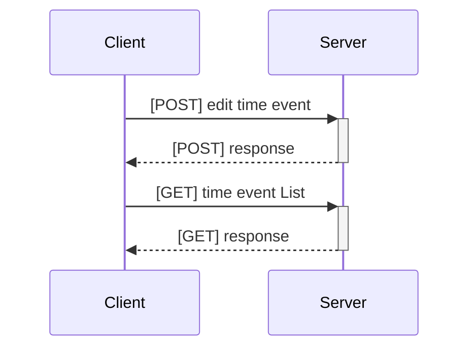
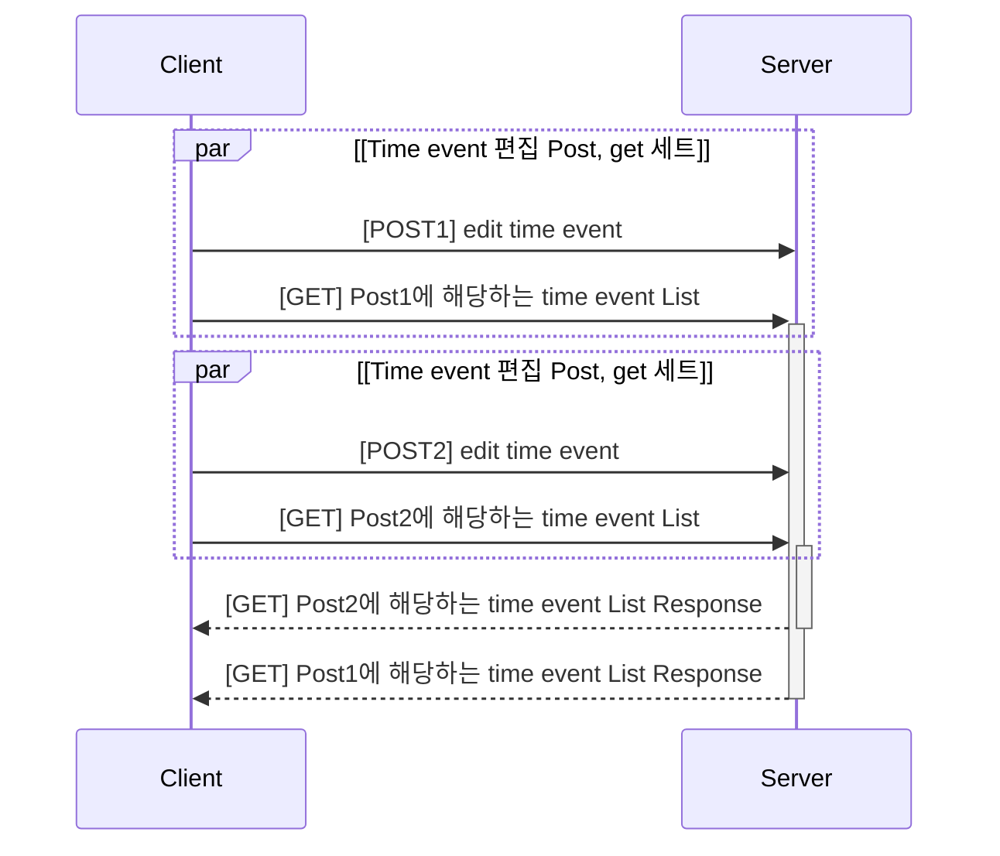
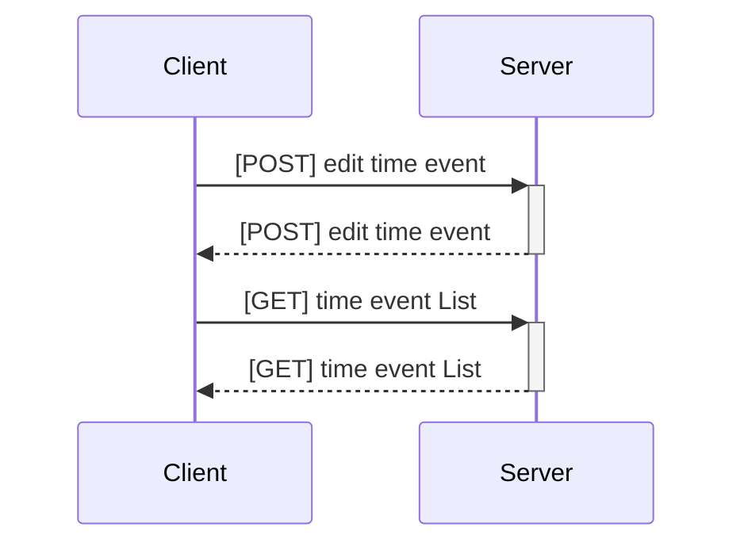
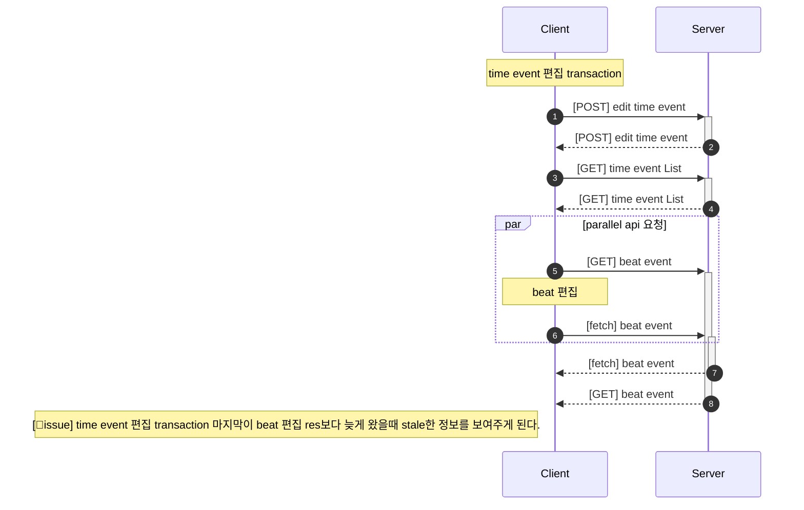
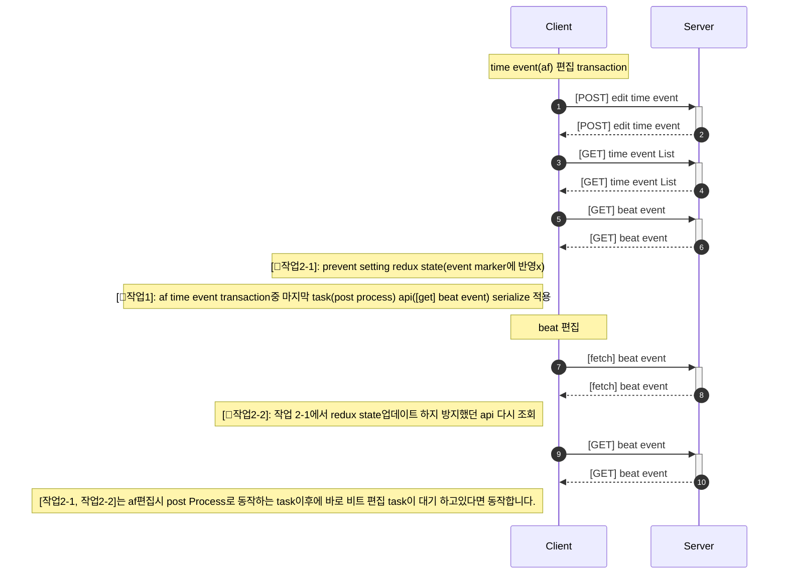
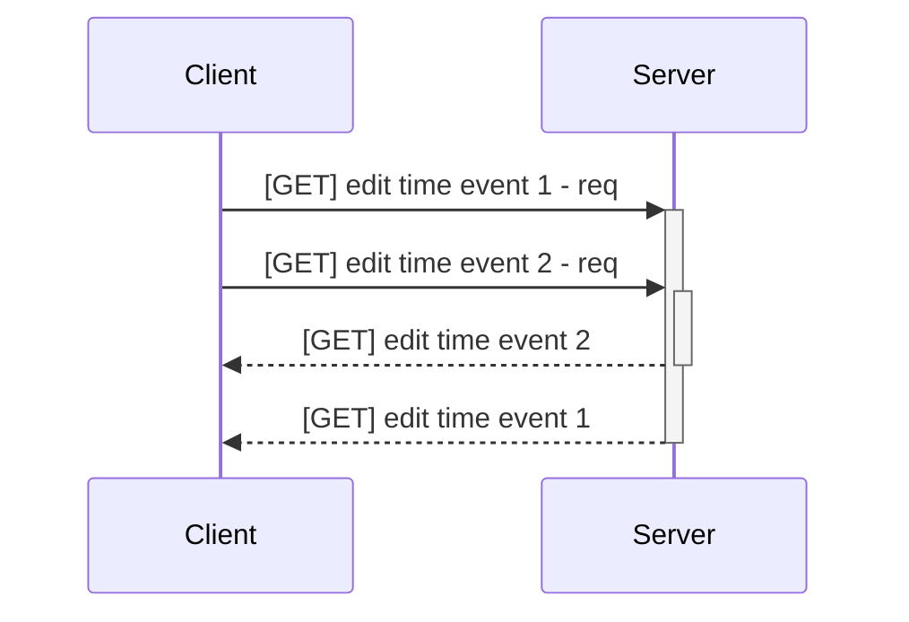
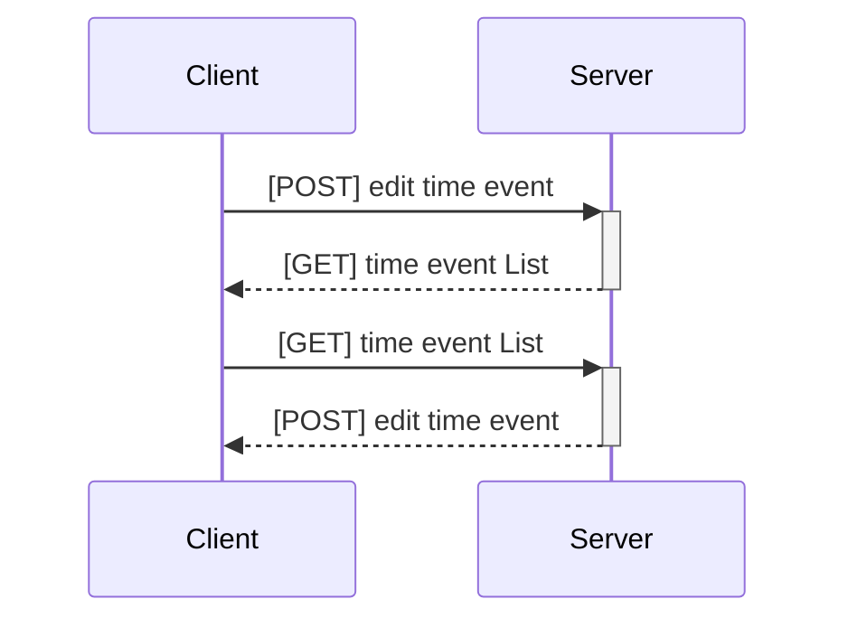

 <!-- time event(af) 제외 편집transaction -->



 <!-- af time event 편집 transaction -->





<!-- 순서가 보장되지 않는 api 1 -->




<!-- trade id가 필요한 api 1 -->



```mermaid
sequenceDiagram
    Alice ->> John: First question
    activate(q1) John
    Alice ->> John: Second question
    activate(q2) John
    John -->> Alice: First answer
    deactivate(q1) John
    John -->> Alice: Second answer
    deactivate(q2) John
```

```mermaid

sequenceDiagram
Activate C1
A->>C: apple
Activate C2
B->>C: orange
C-->>A: banana
Deactivate C1
C-->>B: pear
Deactivate C2

```
