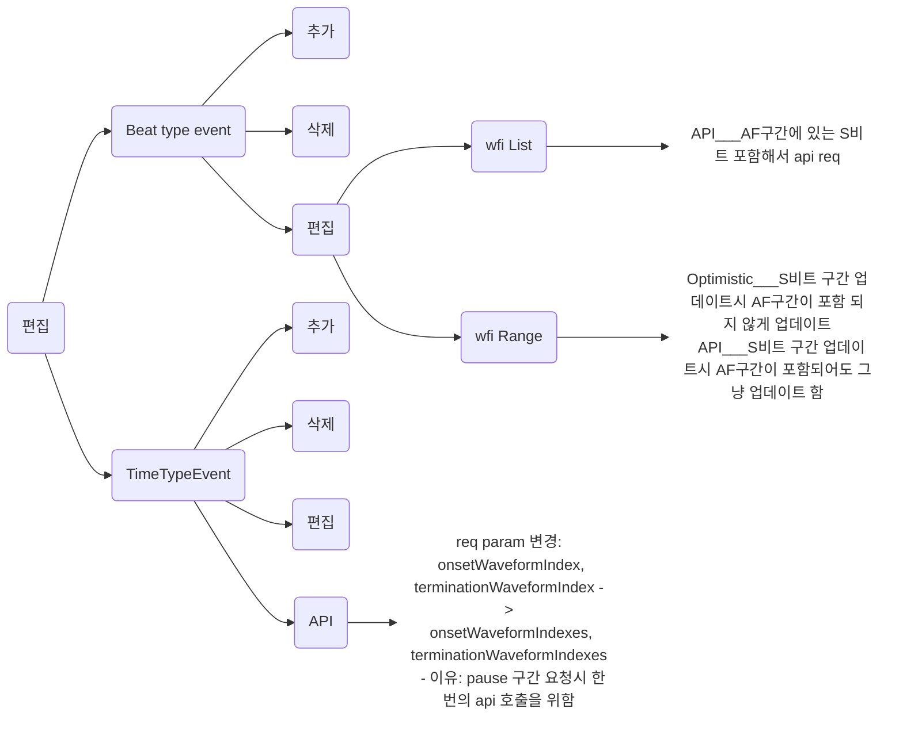
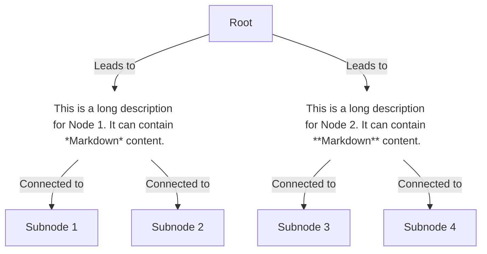

```mermaid

%% graph LR;
%% graph RL;
%% graph TD;
graph LR;
  Root(편집)    --> BeatTypeEvent(Beat type event)
  Root          --> TimeTypeEvent(TimeTypeEvent)

BeatTypeEvent --> BeatTypeEvent_Add(추가)
TimeTypeEvent --> TimeTypeEvent_Add(추가)

BeatTypeEvent --> BeatTypeEvent_Delete(삭제)
TimeTypeEvent --> TimeTypeEvent_Delete(삭제)

BeatTypeEvent --> BeatTypeEvent_Modify(편집)
TimeTypeEvent --> TimeTypeEvent_Modify(편집)
TimeTypeEvent --> TimeTypeEvent_API(API)


BeatTypeEvent_Modify --> BeatTypeEvent_Modify_wfiList(wfi List)
BeatTypeEvent_Modify_wfiList --> BeatTypeEvent_Modify_wfiList1(API___AF구간에 있는 S비트 포함해서 api req)

BeatTypeEvent_Modify --> BeatTypeEvent_Modify_wfiRange(wfi Range)
BeatTypeEvent_Modify_wfiRange --> BeatTypeEvent_Modify_wfiRange1(
  Optimistic___S비트 구간 업데이트시 AF구간이 포함 되지 않게 업데이트
  API___S비트 구간 업데이트시 AF구간이 포함되어도 그냥 업데이트 함)


TimeTypeEvent_API --> TimeTypeEvent_API1(
  req param 변경:
  onsetWaveformIndex, terminationWaveformIndex ->
  onsetWaveformIndexes, terminationWaveformIndexes
  - 이유: pause 구간 요청시 한번의 api 호출을 위함)


%% 정렬 테스트 필요.


%% Remove the box for Node 1
style BeatTypeEvent_Modify_wfiList1 fill:transparent,stroke:transparent
style BeatTypeEvent_Modify_wfiRange1 fill:transparent,stroke:transparent
style TimeTypeEvent_API1 fill:transparent,stroke:transparent
%%BeatTypeEvent_Modify_wfiList["AF구간에 있는 S비트 포함"]
```

```mermaid
graph TD;
  A[Root] -->|Leads to| B[Node 1]
  A -->|Leads to| C[Node 2]
  B -->|Connected to| D[Subnode 1]
  B -->|Connected to| E[Subnode 2]
  C -->|Connected to| F[Subnode 3]
  C -->|Connected to| G[Subnode 4]

%% Remove the box for Node 1
style B fill:transparent,stroke:transparent
B["This is a long description for Node 1. It can contain *Markdown* content."]

%% Remove the box for Node 2
style C fill:transparent,stroke:transparent
C["This is a long description for Node 2. It can contain **Markdown** content."]


```
