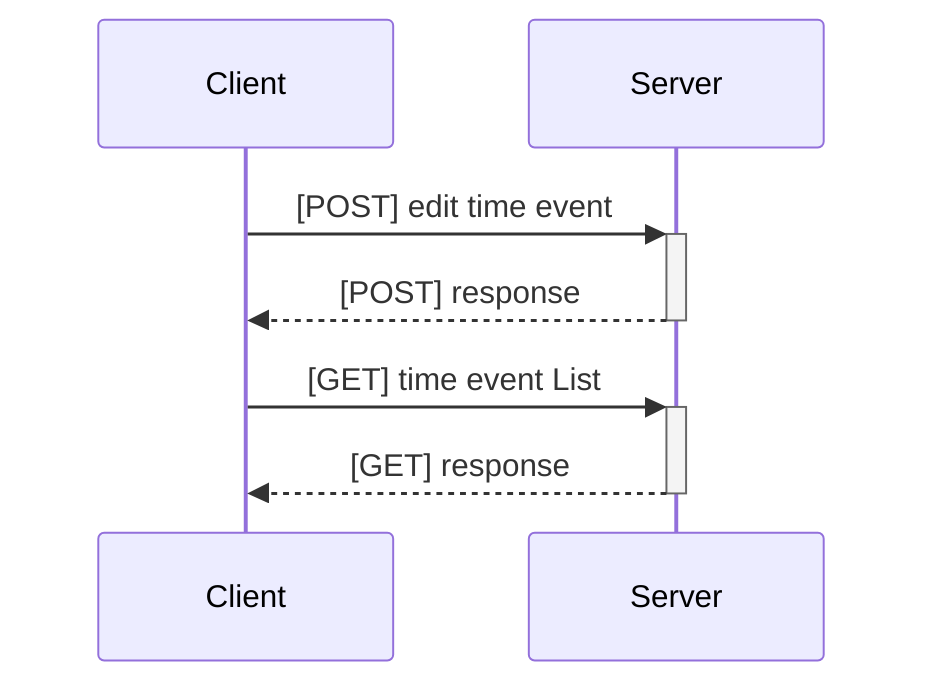
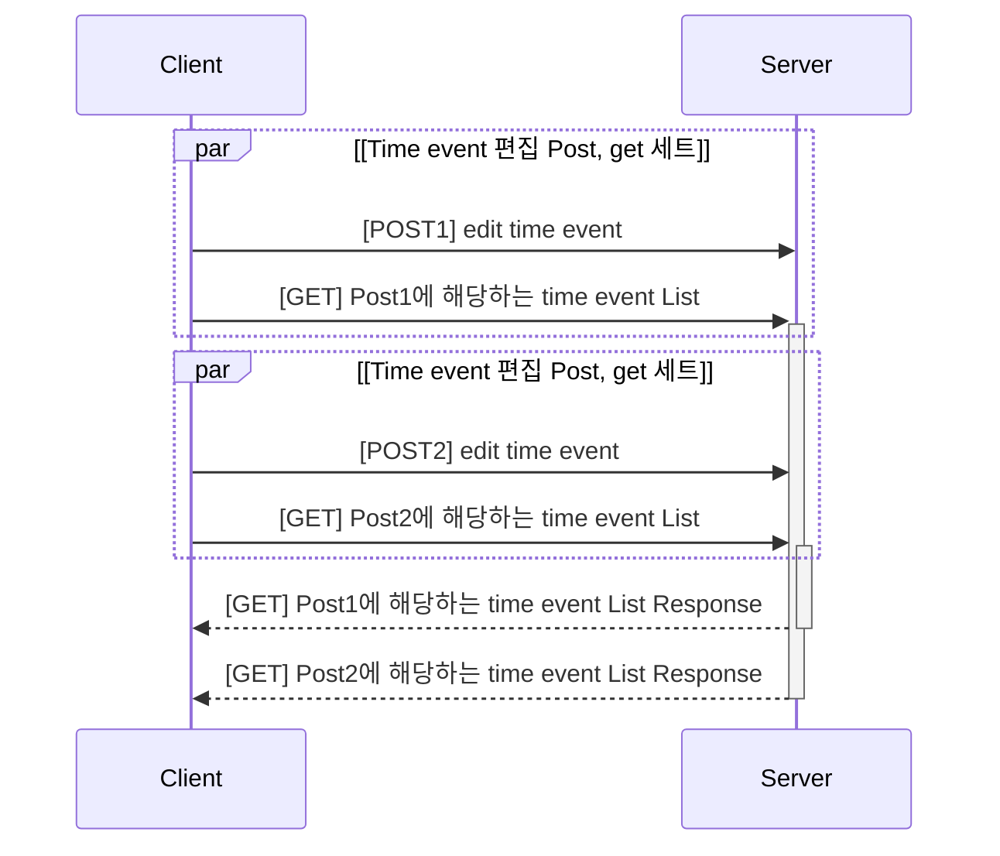

    deactivate Client
    <!-- client-->>+server: time event 편집 api
    server<<--client: time event 편집 api -->

    Note over client: A typical interaction<br/>But now in two lines

Alice->>+John: Hello John, how are you?
John-->>-Alice: Great!

```mermaid

sequenceDiagram
    Alice ->> John: First question
    activate John: q1
    Alice ->> John: Second question
    activate John: q2
    John -->> Alice: First answer
    deactivate John: q1
    John -->> Alice: Second answer
    deactivate John: q2

```
