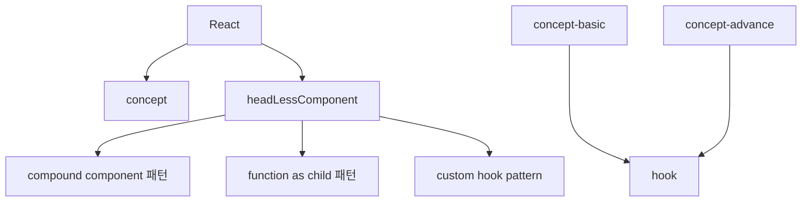
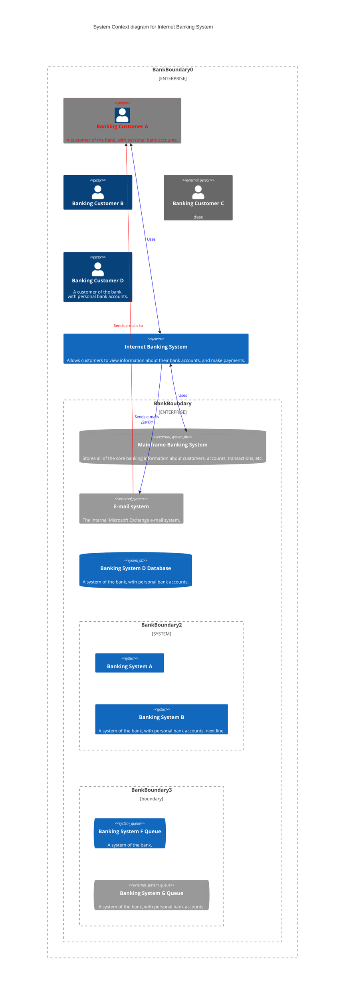

# learning_PlantUML

PlantUML을 익히는 repository 입니다.

# 폴더 구성 설명

- plantuml에서 제공하는 공식문서 pdf의 순번을 채용 했습니다.
  - plantuml 공식문서 pdf: https://plantuml.com/ko/guide

# 공식 문서

- https://plantuml.com/ko/
  - 다이어 그램 종류 별로 예제와 작성 옵션들이 설명 되어 있다.
  - pdf: https://plantuml.com/ko/guide
- https://github.com/qjebbs/vscode-plantuml
  - vscode에서 plantuml 과련 옵션들이 설명 되어 있다.

# short cut

- PlantUML preview

  ```
    option + d
  ```

- preview md file
  ```
    shift + cmd + v
  ```

# 설치 방법

> 1->2 실패시 1->3번 과정 진행

1. vscode plantUML 설치

- https://marketplace.visualstudio.com/items?itemName=jebbs.plantuml

2. plantUML에서 요구하는 dependency program 설치

- [plantUML 공식 github 기준](https://github.com/qjebbs/vscode-plantuml)으로는 아래 두개를 설치하면 된다. (23.03.03 기준)
- 그러나 temurin이 설치로 PlantUML Preview가 동작하지 않는다.
- 만약 설치가 되지 않는다면 3번까지 진행 필요

  ```jsx
  brew install --cask temurin
  brew install graphviz
  ```

3. jdk 설치

- 2번 과정으로 실패시 진행
- jdk11이 temurin으로 대체 됐으나 temurin으로 plantUML을 rendering할 수 없었다.
- 혹시 몰라 설치 해보니 … “no valid diagram found here plantuml” 이 문구가 나오면서 render 안되는 문제가 해결 됐다.

  ```jsx
  brew install --cask adoptopenjdk11

  ||

  brew install --cask adoptopenjdk
  ```

# mermaid

- mermaid도 md파일로 작성하면 그래프를 그릴 수 있다.
- [mermaid 공식 문서](https://mermaid.js.org/intro/)

## mermaid 공식 문서 톱아 보기

- C4 Diagrams
- [C4 Diagrams 공식 문서 주소](https://mermaid.js.org/syntax/c4.html)
- React Component를 표현하기에 좋아 보이는 구조

## 작성 방법 예시




