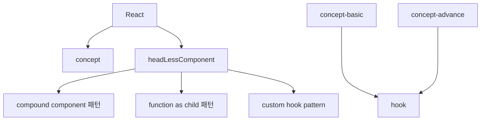

```mermaid
graph TD
A[React] --> CCT[concept]
A[React] --> HLC[headLessComponent]


CCT-basic[concept-basic] ---> Hook[hook]
CCT-advance[concept-advance] ---> Hook[hook]

HLC --> HLC.1[compound component 패턴]
HLC --> HLC.2[function as child 패턴]
HLC --> HLC.3[custom hook pattern]
```

# headLessComponent

- https://www.youtube.com/watch?v=aAs36UeLnTg
