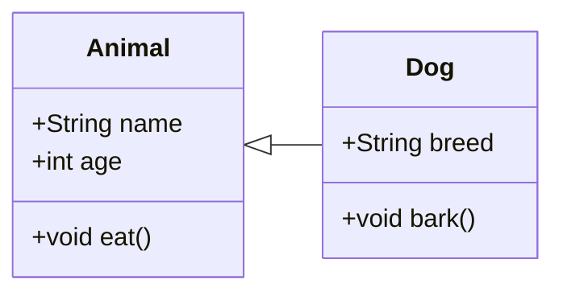
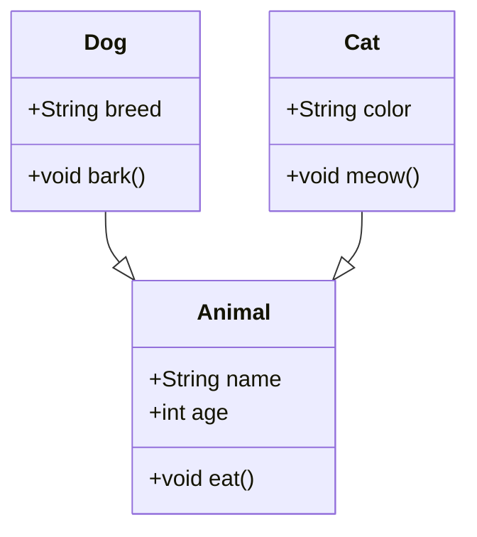

```mermaid
classDiagram
  direction LR
  class Animal {
    +String name
    +int age
    +void eat()
  }

  class Dog {
    +String breed
    +void bark()
  }

  Animal <|-- Dog

```

```mermaid
classDiagram
  direction BT
  class Animal {
    +String name
    +int age
    +void eat()
  }

  class Dog {
    +String breed
    +void bark()
  }

  class Cat {
    +String color
    +void meow()
  }

  Animal <|-- Dog
  Animal <|-- Cat

```
